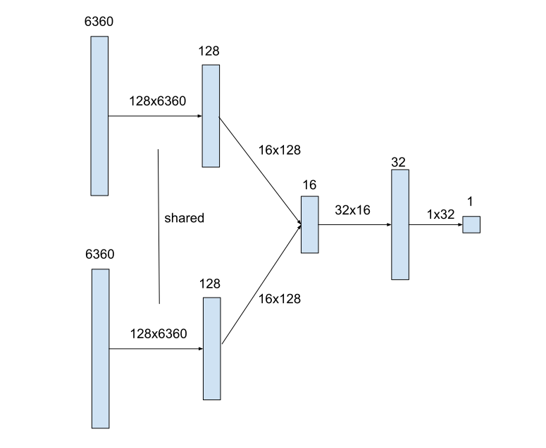

# Wazir Drop: a tournament winning board game AI engine

This is an AI game engine for the game 0.1 that participated in the
[CodeCup 2026](https://www.codecup.nl/)
online tournament. WazirDrop took [first place](https://www.codecup.nl/competition.php?comp=344)!

- [Wazir Drop: a tournament winning board game AI engine](#wazir-drop-a-tournament-winning-board-game-ai-engine)
- [The game](#the-game)
  - [Pieces](#pieces)
  - [Setup phase](#setup-phase)
  - [Captures and drops](#captures-and-drops)
- [GUI](#gui)
- [Position representation](#position-representation)
- [Move representation](#move-representation)
- [Reinforcement learning](#reinforcement-learning)
  - [Evaluation as logit](#evaluation-as-logit)
  - [Training loop](#training-loop)
  - [Self play](#self-play)
  - [Training a model using tch](#training-a-model-using-tch)
  - [Simple material evaluation](#simple-material-evaluation)
  - [Linear model with piece-square features](#linear-model-with-piece-square-features)
  - [Wazir-piece-square features](#wazir-piece-square-features)
- [NNUE: efficiently updateable neural network](#nnue-efficiently-updateable-neural-network)
  - [Accumulator update](#accumulator-update)
  - [Quantization and SIMD](#quantization-and-simd)
- [Move generation](#move-generation)
  - [Setup moves](#setup-moves)
  - [Pseudomoves vs regular moves](#pseudomoves-vs-regular-moves)
  - [Check evasions](#check-evasions)
  - [Checks](#checks)
  - [Check threats](#check-threats)
  - [Escape square attacks](#escape-square-attacks)
- [Tree search](#tree-search)
  - [Quiescence search](#quiescence-search)
  - [Move ordering](#move-ordering)
  - [Transposition table](#transposition-table)
  - [Miscellaneous improvements](#miscellaneous-improvements)
- [Time allocation](#time-allocation)
- [Repetitions](#repetitions)
  - [Optimism factor](#optimism-factor)
- [Opening book](#opening-book)
  - [Reasonable setups](#reasonable-setups)
  - [Book generation](#book-generation)
  - [How we play in the opening phase](#how-we-play-in-the-opening-phase)
- [Data compression](#data-compression)
  - [Base 128 encoding in UTF-8](#base-128-encoding-in-utf-8)
  - [Encoding NNUE weights](#encoding-nnue-weights)
  - [Encoding setup moves](#encoding-setup-moves)
- [Final thoughts](#final-thoughts)


# The game

[0.1 (Zero Point One)](https://boardgamegeek.com/boardgame/114307/01-zero-point-one) is a board game designed by Jim Wickson. It is similar to [chess](https://en.wikipedia.org/wiki/Chess), and even more similar to [shogi](https://en.wikipedia.org/wiki/Shogi) or [crazyhouse](https://en.wikipedia.org/wiki/Crazyhouse).


## Pieces

The game only uses unorthodox chess-like pieces, called [fairy chess pieces](https://en.wikipedia.org/wiki/Fairy_chess_piece). In particular, it only uses what are called ["leapers"](https://en.wikipedia.org/wiki/Fairy_chess_piece#Leapers).

A **leaper** is a piece that can jump a fixed offset away in any direction, potentially jumping over any other pieces. A chess knight is a leaper: it jumps by a [1, 2] vector in any of 8 directions (e.g. 1 square left, 2 squares down). In 0.1 terminology, a knight is a piece we can call "1.2".

The leapers used in 0.1 are:
* 0.1, [Wazir](https://en.wikipedia.org/wiki/Wazir_(chess)). It moves one square orthogonally. This is the equivalent of a chess King, but it can't move diagonally.
* 1.1, [Ferz](https://en.wikipedia.org/wiki/Ferz). It moves one square diagonally.
* 0.2, [Dababba](https://en.wikipedia.org/wiki/Dabbaba_(chess)). It moves or jumps two squares orthogonally.
* 1.2, [Knight](https://en.wikipedia.org/wiki/Knight_(chess)). This is just a regular chess knight.
* 2.2, [Alfil](https://en.wikipedia.org/wiki/Alfil). It moves or jumps two squares diagonally.

The goal of the game is to capture the opponent wazir. That's like in chess, except moving into check is allowed (but not advisable), and after giving a checkmate you still have to make an extra move to actually capture the wazir.

## Setup phase

Each player starts with 1 wazir, 2 ferzes, 4 dababbas, 1 knight and 8 alfils.

Each player can set up the pieces in any order they want in the first two rows on their side of the board. Red goes first, then blue.

## Captures and drops

Like in chess, you capture opponent pieces by landing on them. The difference is that after you capture an opponent piece, you can later **drop** it onto any empty square as your own piece, in lieu of a regular move. This is similar to how shogi and crazyhouse are played.

# GUI

In order to be able to play against the engine, I created a graphical
interface. Rather than using circles with numbers, I found it a lot easier to
see what's going on if I use regular chess pieces (king = wazir, pawn = ferz, rook = dababba, bishop = alfil) even though they move differently.


# Position representation

```rust
pub struct Position {
    stage: Stage,
    ply: Ply,
    board: Board,
    captured: Captured,
    null_move_counter: u8,
}
```

The board is represented by a simple square -> color/piece mapping, as well
as a set of bitboards:
* occupied squares for each piece type of a given color
* all squares occupied by a color
* empty squares

```rust
pub struct Board {
    squares: EnumMap<Square, Option<ColoredPiece>>,
    occupied_by: EnumMap<Color, Bitboard>,
    empty_squares: Bitboard,
    occupied_by_piece: EnumMap<ColoredPiece, Bitboard>,
    hash: u64,
}
```

The captured pieces are represented a count for each piece type:

```rust
pub struct Captured {
    sides: EnumMap<Color, CapturedOneSide>,
    hash: u64,
}

pub struct CapturedOneSide {
    counts: EnumMap<Piece, u8>,
}
```

Squares are represented by this funny enum:

```rust
pub enum Square {
    A1, A2, A3, A4, A5, A6, A7, A8,
    B1, B2, B3, B4, B5, B6, B7, B8,
    C1, C2, C3, C4, C5, C6, C7, C8,
    D1, D2, D3, D4, D5, D6, D7, D8,
    E1, E2, E3, E4, E5, E6, E7, E8,
    F1, F2, F3, F4, F5, F6, F7, F8,
    G1, G2, G3, G4, G5, G6, G7, G8,
    H1, H2, H3, H4, H5, H6, H7, H8,
}
```

Why are squares represented as a large 64-element `enum` rather than a simple number such as `u8`? This is for memory efficiency. An enum tells the Rust compiler that only these 64 values are valid. This allows the compiler to optimizer storage in some scenarios. For example it can store `Option<Square>` in 1 byte: 0-63 to represent a square, 64 to represent `None`.

```rust
pub enum Color {
    Red,
    Blue,
}

pub enum Piece {
    Alfil,
    Dabbaba,
    Ferz,
    Knight,
    Wazir,
}

pub enum ColoredPiece {
    RedAlfil,
    BlueAlfil,
    RedDabbaba,
    BlueDabbaba,
    RedFerz,
    BlueFerz,
    RedKnight,
    BlueKnight,
    RedWazir,
    BlueWazir,
}
```

Again we have a separate type for `ColoredPiece` for memory efficiency. Storing `Color` and `Piece` separately would require 2 bytes rather than just 1.


# Move representation

There are four types of moves:
* setup moves (first two moves of the game)
* captures
* jumps (piece moves that don't capture anything)
* drops (put a previously captured piece back on the board)

Setup moves are represented by a simple list of 16 pieces in order:

```rust
pub struct SetupMove {
    pub color: Color,
    // From square 0 or square 63.
    pub pieces: [Piece; 16],
}
```

All other moves (jumps, captures and drops) are represented by this 4-byte data type:
```rust
pub struct Move {
    pub colored_piece: ColoredPiece,
    pub from: Option<Square>,
    pub captured: Option<Piece>,
    pub to: Square,
}
```

If `from` is `None`, we have a drop move. If `captured` is not `None`, we have
a capture move.

The `Move` structure contains more information than what is implied by the CodeCup move notation. This makes it easier to make moves, recognize invalid moves during search, and allows for easier to read notation. For example, instead of `b3c4` I use notation such as `Fb3xwc4` in my logs, so that we know it is a ferz capturing the wazir.

# Reinforcement learning

To do any reasonable tree search, we need an evaluation function that can estimate who is winning and by how much in any given position. But how to build
such a function? I had no idea how much the pieces are worth relative
to each other or how to approach positional evaluation. So I decided to have the evaluation function be trained entirely from self-play games using reinforcement learning.

## Evaluation as logit

Our goal is to have the evaluation function approximate the [logit](https://en.wikipedia.org/wiki/Logit) of predicted win probability. In other words,
we want the win probability to be approximated by the [sigmoid](https://en.wikipedia.org/wiki/Sigmoid_function) of the position evaluation.

If $v$ is the current evaluation, then we estimate win probability as:

$$ p = \sigma(v) = \frac{1}{1 + e^{-v}}$$

We treat draws as equivalent to 50% win probability.


So reasonable evaluations are normally somewhere in the range of [-5, 5].

In internal calculations, we usually scale these by a factor of 10,000 and round to an integer, which gives 4 digits of precision in [-5.0000, 5.0000].

## Training loop

So how do we train an evaluation function? By having the program play against itself and learn from those games.

1. Take the current evaluation model.
2. Collect a lot of game positions and their evaluations using [self play](#self-play).
3. Train a new model based on in-game tree search and game results.
4. Go to 1.

This approach is a type of reinforcement learning, more specifically: Expert Iteration.

I went through many iterations using multiple different models:
* [simple material evaluation](#simple-material-evaluation)
* [linear model with piece-square features](#linear-model-with-piece-square-features)
* linear model with [wazir-piece-square features](#wazir-piece-square-features)
* [neural network](#nnue-efficiently-updateable-neural-network)

The last model, with the neural network, was trained over 7 iterations of the training process.

I ran the last iteration when I went away for a skiing trip for a week. Playing 100 million games took 8 days on a 32-core workstation, and then it took 1 more day to train the model using that data.

## Self play

The goal of self play was to gather a diverse set of positions and get more accurate evaluations than what the current evaluation function
can give us. We also generally want *quiet* positions, meaning positions in which captures aren't imminent. That's because our [tree search](#tree-search) will deal with captures anyway. We just want to be able to evaluate the resulting final positions after such sequences of captures.

Here is what I did:
1. Start each game with completely random initial setups. That is not entirely realistic, but good enough.
2. Do a depth 4 [tree search](#tree-search).
3. Select the position at the end of the [best variation](https://www.chessprogramming.org/Principal_Variation) from the search. This will generally be a quiet position because of [quiescence search](#quiescence-search).
4. Do another, deeper search (extra 4 ply) to evaluate the selected position more accurately.
5. At the root position, pick a move and play it.
6. If the game is not finished, go to 2.

All the positions selected in step 3 are stored in the generated dataset, along with their deeper evaluations and game results.

To get some extra variation in the games beyond just the random starting positions, I don't always pick the best move in step 5. Instead, I randomly pick a move, with better moves having higher probabilities according to the [soft max](https://en.wikipedia.org/wiki/Softmax_function) distribution with a temperature $T$:

 $$ p_i = \frac{e^{v_i / T}}{\sum_i e^{v_i / T}} $$

## Training a model using tch

I trained all models using the [tch](https://crates.io/crates/tch) crate which is a Rust wrapper around for [PyTorch](https://pytorch.org/).

I pass through the dataset around 5-10 times, in random order, and use the [Adam optimizer](https://docs.pytorch.org/docs/stable/generated/torch.optim.Adam.html) with the [binary cross entropy loss](https://docs.pytorch.org/docs/stable/generated/torch.nn.BCEWithLogitsLoss.html) function.

The target value we're trying to learn is a linear combination of deeper evaluation and actual game result. If $v_i$ is the deep evaluation of a position, and $r_i$ is the game result (0, 0.5 or 1), the target values are:

$$ y_i = (1 - \lambda) v_i + \lambda r_i $$

where $\lambda$ is normally set to 0.1.

## Simple material evaluation

But where do we begin the expert iteration learning loop? We need an initial "expert" to start with. I only had a very rough idea how to evaluate positions, I didn't even know which pieces are worth more than others. So I decided to just start with the simplest evaluation possible that I could
come up with:

* every piece on the board gets value 0.1
* every captured piece also gets value 0.1

That's it. That was the only evaluation function that I created manually.

## Linear model with piece-square features

The next step was a linear model with piece-square features. The evaluation is a linear combination of the following features:
* 50 features per side for each piece type / square combination
* 30 features per side for each captured piece type and its number
* 1 feature for side to move (tempo bonus)

There are 64 squares, but because the rules of the game are symmetric
to rotations and reflections of the board, we only use 10 different "normalized squares". For example, each corner square gets the same weight.

```rust
pub enum NormalizedSquare {
    A1, A2, A3, A4,
        B2, B3, B4,
            C3, C4,
                D4,
}
```

These are the actual learned values:
```rust
pub static SCALE: f64 = 1000.0;
pub static TO_MOVE: i16 = 352;

pub static FEATURES: [i16; 80] = [
    // alfil
    83, 89, 163, 222, 112, 194, 203, 311, 313, 365,
    // dabbaba
    74, 60, 115, 185, 59, 181, 212, 320, 330, 309,
    // ferz
    18, 49, 62, 126, 206, 226, 247, 289, 286, 250,
    // knight
    188, 221, 282, 318, 265, 343, 419, 449, 442, 405,
    // wazir
    655, 626, 25, -148, 599, 44, -304, -283, -514, -701,
    // captured alfil
    186, 111, 80, 71, 64, 73, 70, 91, 53, 55, -107, -85, 0, 0, 0, 0,
    // captured dabbaba
    307, 148, 89, 40, 23, 68, -236, 0,
    // captured ferz
    324, 207, 154, 34,
    // captured knight
    442, 344,
];
```

All the values are multiplied by `SCALE = 1000`.

What can we notice here? Knights are the best piece. Pieces are much more valuable in the center, except the wazir which prefers corners. The first captured piece
is much more valuable than more captured pieces of the same type.

## Wazir-piece-square features

For the next, bigger model, we still use a linear combination of features, but this time consider a larger set of features. I realized that piece values are very strongly dependent on where the wazirs are. We want to be attacking the opponent wazir and protecting our own wazir. So we have features for each combination of wazir square plus some other piece square (of the same or opposite color). But first we rotate and/or reflect the board so that the wazir square is normalized. 

There are in total 6360 features per side:
* 10 * 9 * 64 = 5760 features for each wazir square combined with other piece type, color, and square.
* 600 features for each wazir square combined with captured piece type and number.
* a tempo bonus for side to move.

Let's look at some of the weights: when a wazir is in A1 corner, here are the values for a
same-colored alfil:

```rust
// wazir: a1
    // same alfil
       0, -131,  387,  206,  315,  126,   33,   -5,
    -161,   47,  154,   75,  115,  116,   25,   22,
     364,  187,  410,  186,  173,  104,  131,   61,
     146,   99,  213,  294,  198,  152,   72,   36,
     272,  165,  192,  223,  274,  165,   51,  -45,
     117,  142,  116,  125,  173,  161,   73,    3,
      57,   76,  115,   74,   39,   76,   87,  144,
      56,   17,   93,   94,   98,   51,   93,  112,
```

Having an alfil right next to our own wazir (here is the top-left corner) actually has **negative** value! The alfil next to the wazir would just be blocking a potential escape square.

# NNUE: efficiently updateable neural network

The final model uses the same [wazir-piece-square](#wazir-piece-square-features) features, but instead of just using a linear combination of weights, we feed the features to a neural network.



The first layer is an embedding layer. Each of the 6,360 features per side has a corresponding length 128 embedding vector, and those vectors are added together. The weights of the embedding layer are shared between the two sides.

This first layer contains the vast majority of weights: 814,208. The other layers have much fewer weights (just 2,641 total). This, plus the fact that the features are sparse and can be updated incrementally, is what defines a [NNUE](https://en.wikipedia.org/wiki/Efficiently_updatable_neural_network). It allows for very efficient inference.

The resulting vectors are clipped to the [0, 1] range in each hidden layer, i.e.
we use the [Clipped ReLU](https://en.wikipedia.org/wiki/Rectified_linear_unit) (CReLU) activation function.

The two length 128 vectors are concatenated, and then we have 2 more hidden layers with sizes 16 and 32, and finally the output layer with just 1 value, the position evaluation.


## Accumulator update

The first layer would be computationally expensive to evaluate, but there are two aspects that make it much easier.

First, the features are *sparse*. Out of the 12,720 features for both sides, exactly 32 are active because that's how many pieces are always on the board or captured. So evaluating the embedding layer comes down to adding 32 vectors.

Additionally there is an extra optimization: we can compute the embedding incrementally. When we make a move, only up to 4 features typically change:

* a piece is removed from the source square (or captured list when dropped)
* a piece is inserted in its destination square
* a captured piece is removed
* a captured piece is added to the captured list

So we can update the embedding layer (which we call the accumulator) incrementally. On every move we only have to subtract up to 2 vectors and add 2 vectors.

The only exception is wazir moves. When the wazir moves, all the features for one side change. In that case we refresh the accumulator, meaning we have to add up to 32 (16 on average) vectors.

## Quantization and SIMD

During the CodeCup tournament, only a single CPU was available to each player. We use x86-64 SIMD instructions to evaluate the network efficiently. Unfortunately we couldn't use dedicated AVX2 VNNI instructions specialized for neural networks because the CPU used for the tournament didn't implement those. So we had to make do with older SSE instructions.

A crucial SIMD instruction is [PMADDUBSW](https://www.felixcloutier.com/x86/pmaddubsw) which can do 16 single byte multiplications in a 128-bit SIMD register.

So we want to store our values and weights in single bytes. All our weights are scaled and quantized to integers in the range [-127, 127].

The weights in the first layer are scaled by a factor of 127, so the embeddings are in the [-1, 1] range.

The weights in the second layer (256 -> 16) are scaled by a factor of 256. So it only supports weights in the range [-0.49, 0.49]. We clip all weights to this range during training.

The next layer (16 -> 32) is scaled by a factor of 64, so we support weights in the range [-1.98, 1.98].

The weights in the final layer are scaled by a factor of 10,000 / 127 = 78.7, so there we support weights in the range [-1.61, 1.61].

This way the final evaluation as an integer is scaled by a factor of 10,000: logit 1 corresponds to the value 10,000.

# Move generation

## Setup moves

We can generate all possible setup moves by permuting the 16 pieces. The number of such moves is:

$$ \frac{16!}{8!\ 4!\ 2!\ 1!\ 1!} = 10810800$$

During actual gameplay, this function is never used, however, as it would be too slow. Instead, we use the [opening book](#opening-book).

## Pseudomoves vs regular moves

Game rules don't technically distinguish "checks" as a special move type and allow the wazir to move into check or ignore a check. But we don't normally generate such "suicide" moves at all. I call those "pseudomoves". The only time we need them is the last two moves of the game where the wazir is checkmated and both sides still have to make one (pseudo-)move each to capture it.

## Check evasions

When the wazir is in check, the only moves we consider are check evasions. These
are (generated in this order):
* capture the checking piece
* move the wazir with a capture
* move the wazir without a capture

## Checks

We generate checks separately. A jump check always moves a piece from a square two moves away from the opponent wazir to a square one move away from the opponent wazir. To generate checks quickly, we have these sets of squares precomputed for each piece type and each square of the opponent wazir.

## Check threats

We also generate check **threats** separately. Those are moves that threaten to
give a check next move. Jump checks move a piece from a square *three* moves away from the opponent wazir to a square *two* moves away from the opponent wazir. So we also precompute sets of squares three moves away.

## Escape square attacks

Another kind of move we generate separately are "escape square attacks". Those are moves that attack a square that is next to the opponent wazir, restricting
its future escape paths. To generate these efficiently, for each piece type and wazir square we precompute the set of squares that are reachable in:
* one wazir move + one piece move; these are the destination squares of escape square attacks
* one wazir move + two piece moves; these are the "from" squares of such attacks


# Tree search

We use a variant of alpha-beta search ([Principal Variation Search](https://en.wikipedia.org/wiki/Principal_variation_search)).

## Quiescence search

When we reach the full search depth, we keep searching some extra moves in what's called [quiescence search](https://en.wikipedia.org/wiki/Quiescence_search). In this phase we only consider check escapes and captures.

## Move ordering

When not in check, we generate moves in the following order:
1. [Transposition table](#transposition-table) move
2. Captures (in an arbitrary order)
3. [Killer moves](https://www.chessprogramming.org/Killer_Move)
4. Piece drop checks
5. Piece drop escape square attacks
6. Jump checks
7. Jump escape square attacks
8. All other "boring" jumps
9. All other "boring" drops

## Transposition table

The transposition table stores information about positions that have previously been searched with their score, depth searched, best move, etc.

```rust
pub struct TTable {
    buckets: Vec<Bucket>,
    epoch: u8,
}

struct Bucket {
    entries: [PhysicalEntry; 4],
}

struct PhysicalEntry {
    hash: u32,
    epoch: u8,
    depth: Depth,
    mov: Option<Move>,
    score_type: TTableScoreType,
    score: Score,
}

enum TTableScoreType {
    None,
    Exact,
    LowerBound,
    UpperBound,
}
```

## Miscellaneous improvements

[Check extension](https://www.chessprogramming.org/Check_Extensions): every time there is a check we extend search 1 ply deeper. This allows searching forcing sequences with checks deeper.

[Null move pruning](https://www.chessprogramming.org/Null_Move_Pruning): if a position looks good for the side to move (evaluation > beta + 0.1), we try a null move and search 1 ply shallower. If this results in a beta cutoff, just consider the position too good to require full depth search.

[Futility pruning](https://www.chessprogramming.org/Futility_Pruning): at depth = 1, if evaluation looks bad (evaluation < alpha - 0.6), we don't even try boring moves (non-captures and non-checks) because they are unlikely to help.

[Late move reductions](https://www.chessprogramming.org/Late_Move_Reductions): at depth > 1, we search boring moves (other than the first 5) 1 ply shallower than normal. If they turn out to be good moves, we search again with full depth.

# Time allocation

The basic time allocation uses a simple geometric sequence. Each next move gets 5% less time than the previous.

One adjustment to this is *panic mode*. When the evaluation of the best move found so far drops by a significant amount (0.04) from what we thought the value was at the previous lower depth, we allocate up to 5x more time to try to find a better alternative move.

# Repetitions

It's easy to fall into an infinite cycle when playing the game. In [this game](https://www.codecup.nl/showgame.php?ga=322670) Wazir Drop estimated its advantage as +2.6 which corresponds to 93% win probability. But starting from move 37 it went into an infinite forced cycle of checks: Nf7-g5 Wh8-h7 Ng5-f7 Wh7-h8. It seems to the program as if it can just keep doing this and never lose the advantage. The rules allow this, so this went on for the next 60+ moves until draw was automatically declared after move 102, as prescribed by the rules.

To avoid this kind of behavior, after this game I added a simple repetition detection. In tree search, any repetition is automatically considered a draw without further search. So if we have an advantage, we try to avoid repetitions.

To detect repetition we store the history of position hashes, and a [Bloom filter](https://en.wikipedia.org/wiki/Bloom_filter) to make lookups faster.

## Optimism factor

We don't want to try to immediately go into a repetition draw any time we have the slightest disadvantage. Turns out Red has a slight disadvantage at the beginning of the game, but we don't want to try to go for a draw any time we're playing Red: we're optimistic and want to go for a win!

For this reason, I added an "optimism factor". It is often called [contempt factor](https://www.chessprogramming.org/Contempt_Factor) in literature, but I prefer "optimism".

What it does is that I simply add a small constant (+0.1) to the evaluation function for the side Wazir Drop plays. This way it will be slightly over-optimistic about its own chances and pessimistic about opponent's chances, leading to more aggressive play and avoiding draws in equal positions.

# Opening book

The opening book only contains [setups](#setup-moves). We have the best 20,000 red setups and blue's best response to each of them.

## Reasonable setups

The first step in generating the opening book was to reduce the 5,405,400 possible setups (not including their mirror reflections) to a smaller set of "reasonable" setups. We compute 50,000 such reasonable setups.

Here is the algorithm:

1. Take a random sample of 10,000 setups and call those (and their mirror images) "reasonable". They aren't really reasonable, but bear with me.
2. For each possible red setup among the 5,405,400 possible, do a depth-1 search for the best blue response among the "reasonable" setups.
3. Take the best 10,000 red openings as the new "reasonable" setups.
4. Go to 2.

After 3 or 4 iterations this process converges. Then we do one more iteration, but this time we generate 50,000 "reasonable" setups.

## Book generation

We do a tree search for each of the 50,000 reasonable red setups, while only considering reasonable setups as blue responses.

Then we take the top 20,000 red openings and search those 1 ply deeper. Then take the top 8,000 and search 1 ply deeper still. Etc.

In the end, over the course of 24 hours I computed:

* 20,000 setups to depth 11
* 8,000 setups to depth 12
* 3,500 setups to depth 13
* 1,500 setups to depth 14
* 600 setups to depth 15
* 300 setups to depth 16
* 120 setups to depth 17
* 60 setups to depth 18

## How we play in the opening phase

If we're playing red, I just always use the same top setup in the final tournament. It evaluated to about -0.03 for red. We could be a bit more unpredictable and select randomly among the top setup moves. That's what I did in earlier tournaments.

If we're playing blue, then if the opponent is reasonably good, they will probably use one of the top 20,000 setups. Then we just immediately play the pre-computed response.

If they play a setup not in the book then we already have a big advantage. In this case we just do a tree search, treating only the 20,000 setups in the book as possible responses.

# Data compression

The rules of the tournament required putting all the code and data in one source code file with a size limit of 1,474,560 bytes. My final submission was pretty close to this limit: 1,275,891 bytes. This required some compression.

I stored the neural network weights and the opening book as very long [raw string literals](https://doc.rust-lang.org/reference/tokens.html#grammar-RAW_STRING_LITERAL) in the source code. These literals can't just store any random bytes. They have restrictions:

* they can only store valid Unicode codepoints, encoded as [UTF-8](https://en.wikipedia.org/wiki/UTF-8)
* The CR (U+000D) character is not allowed (to avoid issues in different end-of-line conventions between operating systems)
* The quote character (`"`) is allowed but causes escaping complications, so I avoided it.

## Base 128 encoding in UTF-8

The first idea was that I could just use ASCII characters. But if I want to avoid CR and `"`, I'm reduced to 126 possible characters per byte. I could work with that, but a power of 2 would be nicer so that I can just put a constant number of bits per byte.

I could just use 64 ASCII characters per byte. That would let me use 6 bits per byte. That's [Base64](https://en.wikipedia.org/wiki/Base64) encoding.

I wanted to squeeze 7 bits per byte. So I created my own, non-standard Base128 encoding.

But ASCII only gives me 126 characters, not 128. How to squeeze in the extra 2 possibilities per byte? By using non-ASCII Unicode characters!

In UTF-8:

* ASCII characters 0-127 are encoded in a single byte: `0xxxxxxx` in binary.
* Characters 128-2047 are encoded in two bytes: `110xxxxx 10xxxxxx`. That gives me 11 bits of "payload" per two bytes.

So I use the two-byte sequences to encode some sequences of two 7-bit values. The top 4 bits encode the first value and the bottom 7 bits encode the second value.

We want to avoid certain combinations of the top 4 bits:

* We can't use 0000 because that would be an ["overlong encoding"](https://en.wikipedia.org/wiki/UTF-8#Overlong_encodings) of an ASCII character 0-127, which is not allowed in UTF-8.
* We don't want to use 0001 because that corresponds to some special Unicode control characters in the range U+0080 .. U+009F. I just didn't want to have those in my files because they mess up how the files look in my text editor.
* We don't want to use 1100 in order to avoid the U+61C character: ARABIC LETTER MARK, which switches the text display from left-to-right to right-to-left, *really* messing up how the string looks in the text editor.

But that still leaves us with 13 extra values to work with. I used 9 of them to replace certain ASCII control characters: NUL, backspace, tab, LF, VT, FF, CR, ESC and `"`.

Unfortunately I couldn't replace all 32 control ASCII characters, so there is still a bit of visual mess in the string literal, but it's not that bad.

## Encoding NNUE weights

Now that we can encode bits in a string literal, we can use that to encode neural network weights. Since most of the weights are clustered around 0, I used a variable-length encoding:

* sign bit
* lowest 5 bits
* a continuation bit (1 means 5 bits wasn't enough)
* 3 more bits
* another continuation bit
* etc until the whole number is encoded

## Encoding setup moves

Setup moves in the opening book are encoded using a [Huffman code](https://en.wikipedia.org/wiki/Huffman_coding). We could actually create a *perfect* Huffman code for this because all initial piece counts happen to be powers of 2 and the total number of pieces is also a power of 2. The length of each code for a piece is exactly proportional to the logarithm of its frequency.

* alfils are encoded as `0`
* dababbas are encoded as `10`
* ferzes are encoded as `110`
* knights are encoded as `1110`
* wazirs are encoded as `1111`

This makes every setup move take exactly 30 bits.

# Final thoughts

This was a super fun project. Great thanks to the CodeCup team for organizing the tournament, and to other competitors for also creating some very strong programs to play with.

In the final round-robin tournament Wazir Drop ended up with a score of 112 wins, 2 draws and 0 losses, leading to a reasonably secure 1st place. The second place program by Matthijs Tijink had 106 wins, 7 draws and 1 loss.