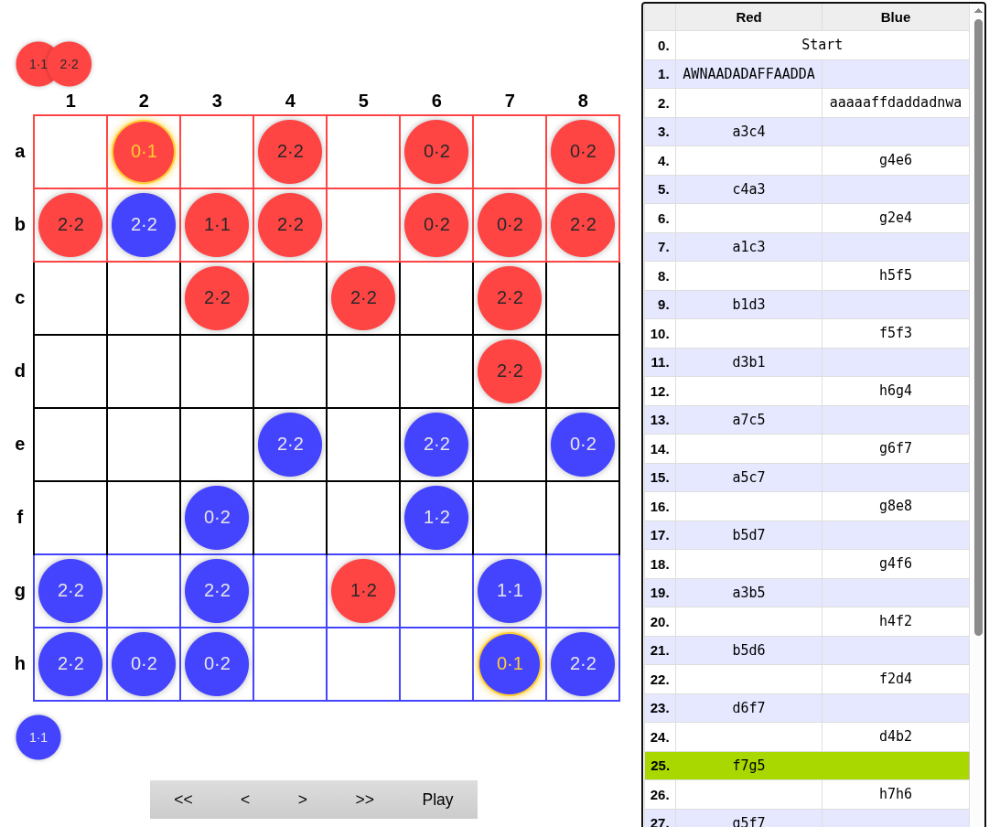
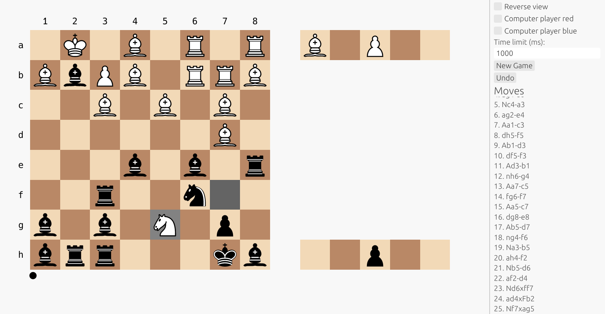

# WazirDrop: tournament winning board game AI engine

This an AI game engine for the game 0.1 that participated in the
[CodeCup 2026](https://www.codecup.nl/)
online tournament. WazirDrop [won](https://www.codecup.nl/competition.php?comp=344)!

- [WazirDrop: tournament winning board game AI engine](#wazirdrop-tournament-winning-board-game-ai-engine)
- [The game](#the-game)
  - [Pieces](#pieces)
  - [Setup phase](#setup-phase)
  - [Captures and drops](#captures-and-drops)
- [GUI](#gui)
- [Position representation](#position-representation)
- [Move representation](#move-representation)
- [Bootstrapping position evaluation](#bootstrapping-position-evaluation)
  - [Evaluation as logit](#evaluation-as-logit)
  - [Self-play](#self-play)
  - [Evaluation training](#evaluation-training)
  - [Starting point: simple material evaluation](#starting-point-simple-material-evaluation)
  - [Linear features](#linear-features)
  - [Piece-square features](#piece-square-features)
  - [Wazir-piece-square features](#wazir-piece-square-features)
- [NNUE: efficiently updateable neural network](#nnue-efficiently-updateable-neural-network)
  - [Accumulator update](#accumulator-update)
  - [Quantization](#quantization)
  - [SIMD](#simd)
- [Move generation](#move-generation)
  - [Setup moves](#setup-moves)
  - [Pseudomoves vs regular moves](#pseudomoves-vs-regular-moves)
  - [Check evasions](#check-evasions)
  - [Checks](#checks)
  - [Check threats](#check-threats)
  - [Escape square attacks](#escape-square-attacks)
- [Alpha-beta search](#alpha-beta-search)
  - [Quiescence search](#quiescence-search)
  - [Move ordering](#move-ordering)
  - [Transposition table](#transposition-table)
  - [Miscellaneous improvements](#miscellaneous-improvements)
- [Time allocation](#time-allocation)
- [Repetitions](#repetitions)
  - [Detecting repetition](#detecting-repetition)
  - [Agressiveness factor](#agressiveness-factor)
- [Opening book](#opening-book)
  - [Reasonable setups](#reasonable-setups)
  - [Setup search](#setup-search)
  - [Book size](#book-size)
  - [Out of book search](#out-of-book-search)
- [Compressing NNUE weights and opening book](#compressing-nnue-weights-and-opening-book)
  - [Base 128 encoding in UTF-8](#base-128-encoding-in-utf-8)
  - [Encoding NNUE weights](#encoding-nnue-weights)
  - [Encoding setup moves](#encoding-setup-moves)


# The game

[0.1 (Zero Point One)](https://boardgamegeek.com/boardgame/114307/01-zero-point-one) is a board game designed by Jim Wickson. It is similar to [chess](https://en.wikipedia.org/wiki/Chess), and even more similar to [shogi](https://en.wikipedia.org/wiki/Shogi) or [crazyhouse](https://en.wikipedia.org/wiki/Crazyhouse).



## Pieces

The game only uses unorthodox chess-like pieces, called [fairy chess pieces](https://en.wikipedia.org/wiki/Fairy_chess_piece). In particular, it only uses what are called ["leapers"](https://en.wikipedia.org/wiki/Fairy_chess_piece#Leapers).

A **leaper** is a piece that can jump a fixed offset away in any direction, potentially jumping over any other pieces. A chess knight is a leaper: it jumps by a [1, 2] vector in any of 8 directions (e.g. 1 square left, 2 squares down). In 0.1 terminology, a knight is a piece we can call "1.2".

The leapers used in 0.1 are:
* 0.1, [Wazir](https://en.wikipedia.org/wiki/Wazir_(chess)). It moves one square orthogonally. This is the equivalent of a chess King, but it can't move diagonally.
* 1.1, [Ferz](https://en.wikipedia.org/wiki/Ferz). It moves one square diagonally.
* 0.2, [Dababba](https://en.wikipedia.org/wiki/Dabbaba_(chess)). It moves or jumps two squares orthogonally.
* 1.2, [Knight](https://en.wikipedia.org/wiki/Knight_(chess)). This is just a regular chess knight.
* 2.2, [Alfil](https://en.wikipedia.org/wiki/Alfil). It moves or jumps two squares diagonally.

The goal of the game is to capture the opponent wazir. That's like in chess, except moving into check is allowed (but not advisable), and after giving a checkmate you still have to make an extra move to actually capture the wazir.

## Setup phase

Each player starts with 1 wazir, 2 ferzes, 4 dababbas, 1 knight and 8 alfils. The goal of the game is to capture the other wazir.

Each player can set up the pieces in any order they want in the first two rows on their side of the board. Red goes first, then blue.

## Captures and drops

Like in chess, you capture opponent pieces by landing on them. The difference is that after you capture an opponent piece, you can **drop** it onto any empty square as your own piece, in lieu of a regular move. This is similar to how shogi and crazyhouse are played.

# GUI

In order to be able to play against the engine, I created a graphical
interface. Rather than using circles with numbers, I found it a lot easier to
see what's going on if I use regular chess pieces (king = wazir, pawn = ferz, rook = dababba, bishop = alfil).



# Position representation

```rust
struct Position {
    stage: Stage,
    ply: Ply,
    board: Board,
    captured: Captured,
    null_move_counter: u8,
}
```

The board is represented by a simple square -> color/piece mapping, as well
as a set of bitboards (for each piece, for each color, empty squares):

```rust
struct Board {
    squares: EnumMap<Square, Option<ColoredPiece>>,
    occupied_by: EnumMap<Color, Bitboard>,
    empty_squares: Bitboard,
    occupied_by_piece: EnumMap<ColoredPiece, Bitboard>,
    hash: u64,
}
```

The captured pieces are just a count for each color/piece:

```rust
struct Captured {
    sides: EnumMap<Color, CapturedOneSide>,
    hash: u64,
}

struct CapturedOneSide {
    counts: EnumMap<Piece, u8>,
}
```

Squares and pieces:

```rust
enum Square {
    A1, A2, A3, A4, A5, A6, A7, A8,
    B1, B2, B3, B4, B5, B6, B7, B8,
    C1, C2, C3, C4, C5, C6, C7, C8,
    D1, D2, D3, D4, D5, D6, D7, D8,
    E1, E2, E3, E4, E5, E6, E7, E8,
    F1, F2, F3, F4, F5, F6, F7, F8,
    G1, G2, G3, G4, G5, G6, G7, G8,
    H1, H2, H3, H4, H5, H6, H7, H8,
}
```

Why are squares represented as an `enum` rather than a number such as `u8`? This is for memory efficiency. An enum tells the Rust compiler that only these 64 values are valid. This allows it to store `Option<Square>` in 1 byte: 0-63 to represent a square, 64 to represent `None`.

```rust
enum Color {
    Red,
    Blue,
}

enum Piece {
    Alfil,
    Dabbaba,
    Ferz,
    Knight,
    Wazir,
}

enum ColoredPiece {
    RedAlfil,
    BlueAlfil,
    RedDabbaba,
    BlueDabbaba,
    RedFerz,
    BlueFerz,
    RedKnight,
    BlueKnight,
    RedWazir,
    BlueWazir,
}
```

Again we have a separate type for `ColoredPiece` for memory efficiency. Storing `Color` and `Piece` separately would require 2 bytes rather than just 1.


# Move representation

There are four types of moves:
* setup moves (first two moves of the game)
* captures
* jumps (piece moves that don't capture anything)
* drops (put a previously captured piece back on the board)

Setup moves are represented by just a list of pieces in order:

```rust
pub struct SetupMove {
    pub color: Color,
    // From square 0 or square 63.
    pub pieces: [Piece; Self::SIZE],
}
```

All other moves (jumps, captures and drops) are represented by this data type:
```rust
pub struct Move {
    pub colored_piece: ColoredPiece,
    pub from: Option<Square>,
    pub captured: Option<Piece>,
    pub to: Square,
}
```

If `from` is `None`, we have a drop move. If `captured` is not `None`, we have
a capture move.

This structure contains more information than what is implied by the CodeCup notation. This makes it easier to make moves, recognize invalid moves during search, and allows for easier to read notation. For example, instead of `b3c4` I internally use notation such as `Fb3xwc4`, so that we know it is a ferz capturing the wazir.

# Bootstrapping position evaluation

To do any reasonable tree search, we need an evaluation function that can estimate who is winning and by how much in any given position. But how to build
such a function? I had no idea how to play the game or how much the pieces are worth relative
to each other. So I decided to have the evaluation function be trained from self-play games.

## Evaluation as logit

Our goal is to have the evaluation function approximate the [logit](https://en.wikipedia.org/wiki/Logit) of predicted win probability. So if $v$ is the current evaluation, then we estimate win probability as:

$$ p = \sigma(v) = \frac{1}{1 + e^{-v}}$$

We treat draws as 50% win, 50% loss.

| evaluation | win probability |
| ---------: | --------------: |
|         -5 |            0.7% |
|         -3 |            4.7% |
|         -1 |           26.9% |
|       -0.5 |           37.8% |
|          0 |             50% |
|        0.5 |           62.2% |
|          1 |           73.1% |
|          3 |           95.3% |
|          5 |           99.3% |

So reasonable evaluations are normally somewhere in the range of [-5, 5]. We normally scale these by a factor of 10 000 and use integer evaluations, so
typically in the range [-50 000, 50 000].

## Self-play

## Evaluation training

## Starting point: simple material evaluation

## Linear features

## Piece-square features

## Wazir-piece-square features

# NNUE: efficiently updateable neural network

## Accumulator update

## Quantization

## SIMD


# Move generation

## Setup moves

We generate all possible setup moves by permuting the 16 pieces. The number of such moves is:

$$ \frac{16!}{8!\ 4!\ 2!\ 1!\ 1!} = 10\ 810\ 800$$

During actual gameplay this function is never used however. Instead, we use the [opening book](#opening-book).

## Pseudomoves vs regular moves

Game rules don't technically distinguish "checks" and allow the wazir to move into check or ignore a check. But we don't normally generate such "suicide" moves at all. I call those "pseudomoves". The only time we need them is the last two moves of the game where the wazir is checkmated and both sides still have to make one (pseudo-)move each to capture it.

## Check evasions

When the wazir is in check, the only move we consider are check evasions. These
are (generated in this order):
* capture the checking piece
* wazir captures
* wazir jumps

## Checks

We generate checks separately. A jump check always moves a piece from a square two moves away from the opponent wazir to a square one move away from the opponent wazir. To generate checks quickly, we have these sets of squares precomputed for each piece type and each square for the opponent wazir.

## Check threats

We also generate check **threats** separately. Those are move that threaten to
give a check next move. Jump checks move a piece from a square *three* moves away from the opponent wazir to a square *two* moves away from the opponent wazir.

## Escape square attacks

Another kind of move we generate separately are "escape square attacks". Those are moves that attack a square that is next to the opponent wazir, restricting
its future escape paths. For this, for each piece and square, we precompute the set of squares that are reachable from a given square by:
* a wazir move + one piece move; these are the destination squares of escape square attacks
* a wazir move + two piece moves; these are the "from" squares of such attacks


# Alpha-beta search

We use a variant of alpha-beta search called [Principal Variation Search](https://en.wikipedia.org/wiki/Principal_variation_search).

## Quiescence search

When we reach the full search depth, we keep searching some moves in what's called [quiescence search](https://en.wikipedia.org/wiki/Quiescence_search). In this phase we only consider check escapes and captures.

## Move ordering

When not in check, we generate moves in the following order:
1. [Transposition table](#transposition-table) move
2. Captures (in an arbitrary order)
3. [Killer moves](https://www.chessprogramming.org/Killer_Move)
4. Piece drop checks
5. Piece drop escape square attacks
6. Jump checks
7. Jump escape square attacks
8. Other jumps
9. Other drops

## Transposition table

The transposition table stores information about positions that have previously been searched with their score, depth searched, etc.

```rust
struct TTable {
    buckets: Vec<Bucket>,
    epoch: u8,
}

struct Bucket {
    entries: [PhysicalEntry; 4],
}

struct PhysicalEntry {
    hash: u32,
    epoch: u8,
    depth: Depth,
    mov: Option<Move>,
    score_type: TTableScoreType,
    score: Score,
}

enum TTableScoreType {
    None,
    Exact,
    LowerBound,
    UpperBound,
}
```

## Miscellaneous improvements

[Check extension](https://www.chessprogramming.org/Check_Extensions): every time there is a check we extend search 1 ply deeper. This allows searching forcing sequences with checks deeper.

[Null move pruning](https://www.chessprogramming.org/Null_Move_Pruning): if a position looks good for the side to move (evaluation > beta + 0.1), we try a null move and search 1 ply shallower. If this results in a beta cutoff, just use it.

[Futility pruning](https://www.chessprogramming.org/Futility_Pruning): at depth = 1, if evaluation looks bad (evaluation < alpha - 0.6), we don't even try boring moves (non-captures and non-checks).

[Late move reductions](https://www.chessprogramming.org/Late_Move_Reductions): at depth > 1, we search boring moves (other than the first 5) 1 ply shallower. If they turn out to be good move, we search again with full depth.

# Time allocation

The basic time allocation uses a simple geometric sequence. Each next move gets 5% less time than the previous.

One adjustment to this is *panic mode*. When the evaluation of the best move found so far drops by a significant amount (0.04) from the previous lower depth, we allocate up to 5x more time to try to find a better alternative move.

# Repetitions

## Detecting repetition

## Agressiveness factor


# Opening book

## Reasonable setups

## Setup search

## Book size

## Out of book search

# Compressing NNUE weights and opening book

## Base 128 encoding in UTF-8

## Encoding NNUE weights

## Encoding setup moves